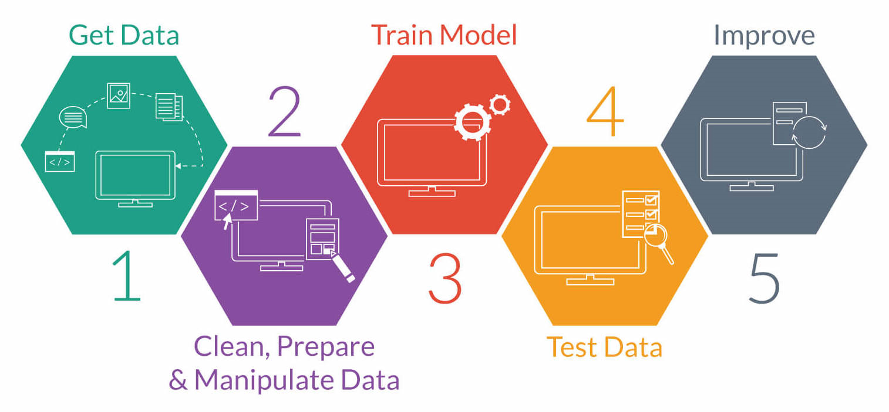

# Data Science Project Workflow

=================================================================================
Starting your first data science project using a `cookie-cutter` template for creating project directories and workflow

## Author

**Akshi Chaudhary**

`Master of Data Science` at *University of British Columbia*

`github` [@akshi8](https://github.com/akshi8)

**Latest Update** : November 19th, 2017

## Project Overview
------------------------------------------------------------------------------------------------------
The figure below shows the steps involved in a typical data science workflow.  

 

A good workflow for a particular team depends on the tasks, goals,
and values of that team, whether they want to make their work
faster, more efficient, correct, compliant, agile, transparent, or
reproducible

Project directory setup is the preliminary step before getting diving into data, code or analysis. For this reason a cookie_cutter template of creating project repo can prove very useful

> **Step 1**: `Data and Code Organization`

* The cookie-cutter shell script first creates the main project directory like `data_science_project` or anything based on the `user input` under which other sub-directories containing data, scripts, visualizations, documentation etc. will be created

* The License File for this project is created as `LICENSE.md` containing the copyright and legal notices based on the username and date of initializing this project

* The sub-directories created using shell script will initially have `test` files so that the user doesn't push empty directories to github

* The project directory map will look something like this:

 `data_science_project` or `@project_name`

  1. `citations` : For including any References or Citation docs for this project
  2. `data` :
      * `external`
      * `processed`
      * `raw`

    > Based on the various stages of the data processing, the raw, external and processed data can be stored

  3. `docs`: For storing import docs, discussions or scripts for this project
  4. `emails` : Saving important emails and attachments
  5. `from_team`: Any miscellaneous data or document from other team members that is relevant for the project
  6. `models` : Model outputs and iterations
  7. `notebooks` : storing `R`, `python` `Jupyter` notebooks
  8. `reports` :
      * `images`:
      * `figures`

    > Includes important figures and images from visualizations

  9. `src` : source code

  `LICENSE.md` : License and copyright files

  `README.md`  : Project description which can be updated later by the user

## Steps to clone this repo

* `git clone`

    Clone this repo using the below code snippet in command-line

      git clone https://github.com/akshi8/data_sci_project.git

* `cookie_cutter shell script`

  Now that you have the README, LICENSE and cookie_cutter.sh file run the shell script

  For this you will be creating your own project repo locally with all necessary files and directories by running the following

  **Make sure you make the cloned repo as your current directory**

      cd data_sci_project
      bash cookie_cutter.sh

> There you have it, your data-science project empty directory structure to begin with your DS project

## Git push

* The `cookie_cutter` shell script also creates a clone of your local data science repo that you just created by pushing it to your `github` space

* The code has been added to the shell script itself

=================================================================================
### Issues

Add issues on this github repo is case of any trouble
